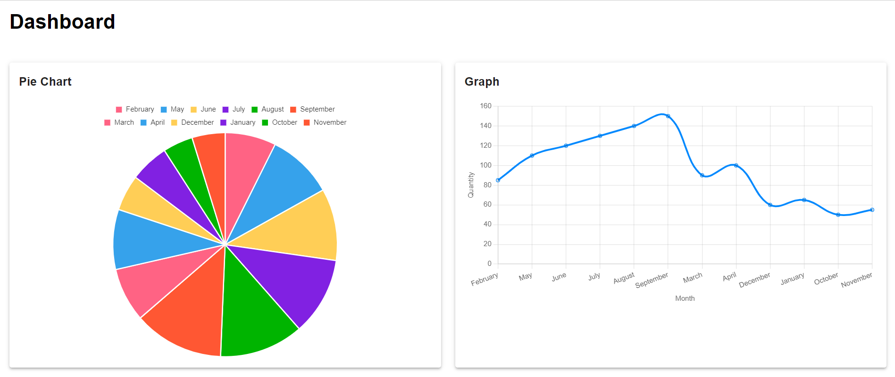
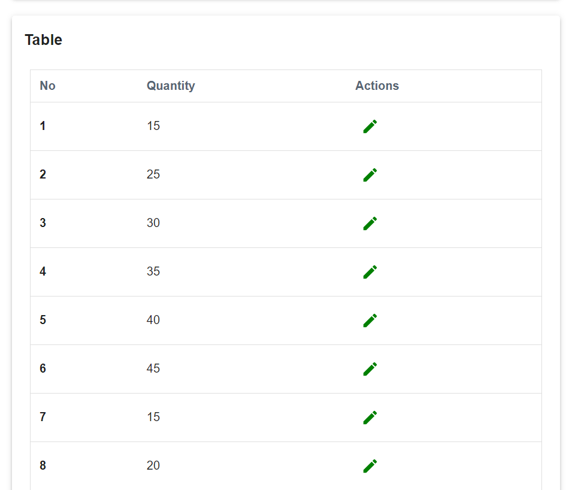
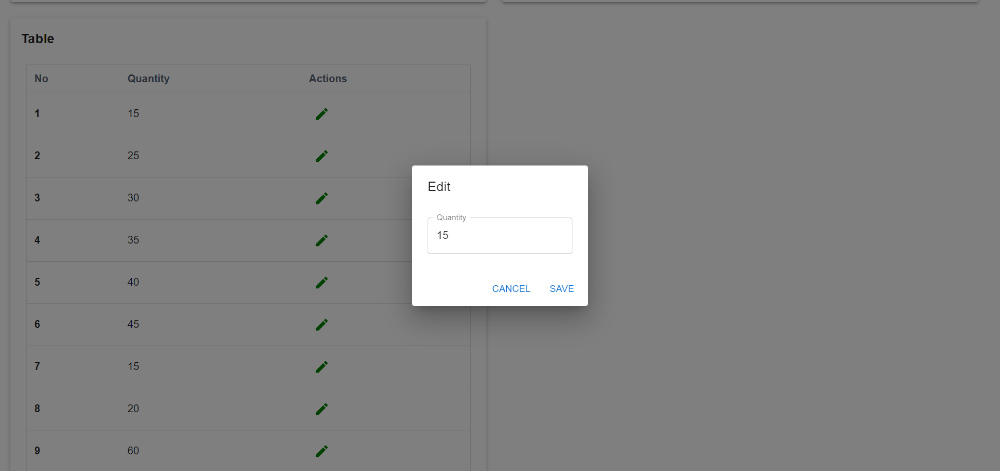

This is a [Next.js](https://nextjs.org/) project bootstrapped with [`create-next-app`](https://github.com/vercel/next.js/tree/canary/packages/create-next-app).

## Getting Started

First, run the development server:

```bash
npm run dev
# or
yarn dev
# or
pnpm dev
# or
bun dev
```

Monthly Quantity Dashboard
This is a simple dashboard that shows how many items are used or sold each month.

Features
Line Chart: Shows the quantity of items over the months.
Monthly Breakdown: Details the quantity for each month.
Easy to Use: Just run the app and see the dashboard.
Technologies Used
Next.js: Framework for building the app.
Chart.js: Library for creating charts.
React: Library for building interfaces.
Material-UI: Framework for UI components.
Axios: For making HTTP requests.








